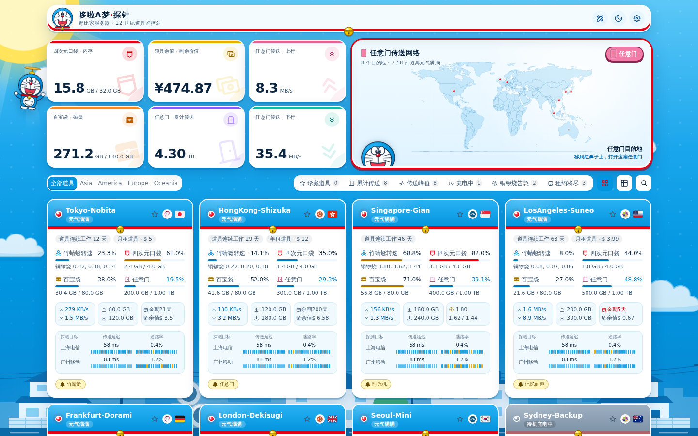
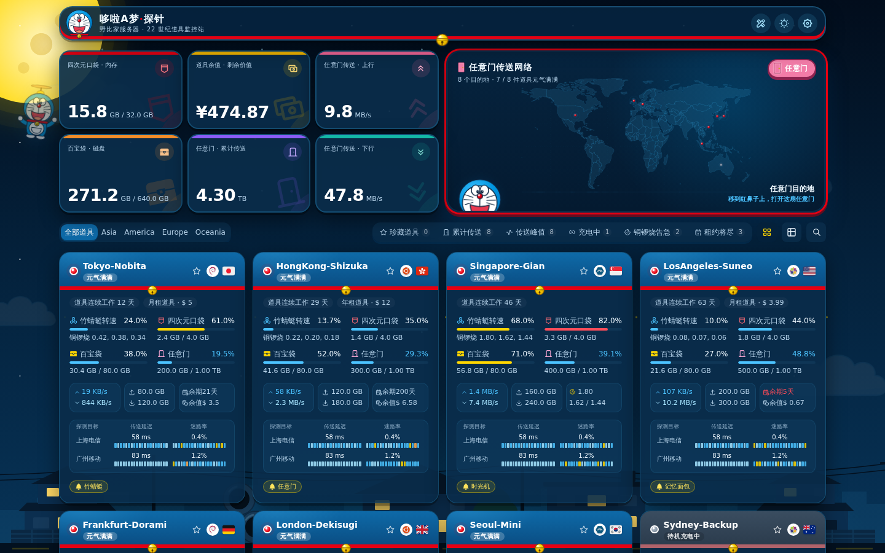
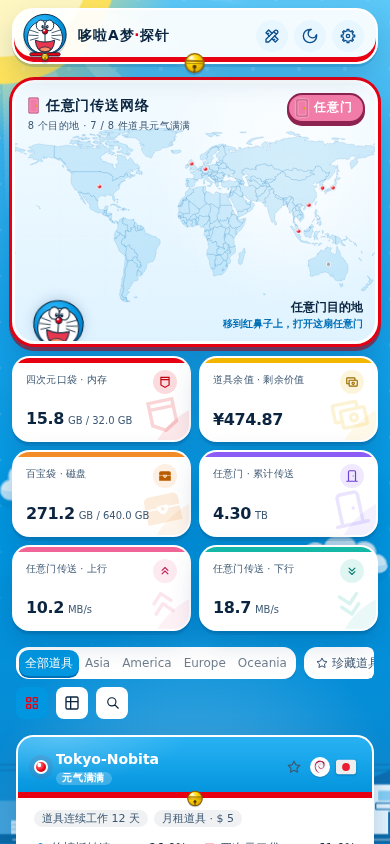
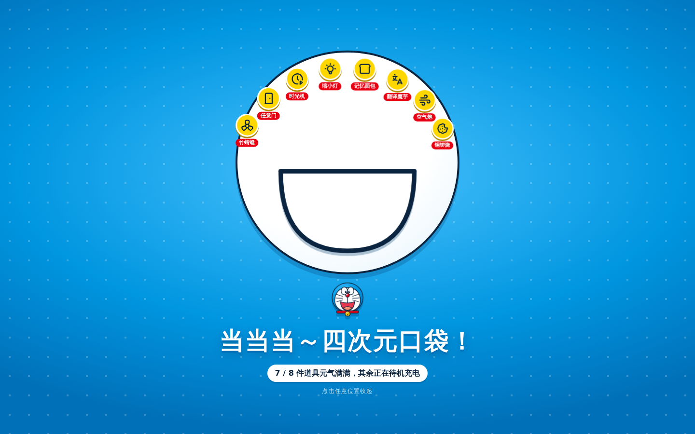
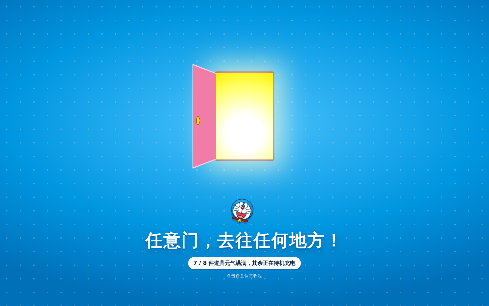

# 🔔 哆啦A梦探针 · Doraemon Probe

> 一套给[极简探针 Monitor](https://github.com/monitor-probe/monitor) 用的哆啦A梦主题。服务器是一件件神奇道具，监控面板就是 22 世纪的道具监控站。

<p align="center">
  
</p>

|                                夜空充电模式                                |                              移动端                              |
| :------------------------------------------------------------------------: | :--------------------------------------------------------------: |
|  |  |

|                            🔔 黄铃铛彩蛋 · 四次元口袋                            |                               🚪 任意门彩蛋                                |
| :------------------------------------------------------------------------------: | :------------------------------------------------------------------------: |
|  |  |

## ✨ 特色

- **哆啦A梦配色**：哆啦A梦蓝 `#0096E0` 做页面主体，卡片是不透明白色、深蓝文字，保证可读。红色 `#E60012`（鼻子、项圈）和金色 `#FFD700`（铃铛）做点缀；概览指标卡另外配了一组道具色。
- **哆啦A梦本体登场**：顶栏 Logo、加载页、地图左下角探头的都是哆啦A梦，天空里还有一只戴着竹蜻蜓的哆啦A梦慢慢飞过。
- **悬浮项圈顶栏**：顶栏是一块悬浮的白色胶囊，底边是红色项圈，正中挂着一颗会晃的金铃铛。
- **哆啦A梦节点卡**：每张节点卡是蓝色的头、红项圈加金铃铛、白肚皮；离线节点的头会变成灰蓝色。
- **道具色指标卡**：概览的六项指标各有一种道具色（口袋红、铜锣烧金、任意门粉、百宝袋橙……），带圆形图标徽章和大号水印图标。
- **大雄的小镇**：页面底部是小镇天际线，有房子、电线杆和空地上的三根水泥管；夜里窗户会亮灯。
- **红鼻子状态灯**：在线节点是会呼吸的红鼻子，离线节点是灰色鼻子，并显示「待机充电中」遮罩。
- **任意门传送网络**：世界地图上用红鼻子标出节点所在的国家或地区，悬停后该国家或地区变成铃铛金色。
- **竹蜻蜓加载动画**：哆啦A梦顶着旋转的竹蜻蜓上下浮动。
- **两个彩蛋**：点顶栏的哆啦A梦，白肚皮上的四次元口袋会把道具一件件抛出来；点地图上的「任意门」，粉色的门会打开并透出光。
- **道具标签**：每台服务器随机分到一件不重复的道具（竹蜻蜓、时光机、记忆面包……）。
- **晴空 / 夜空充电模式**：可以按北京时间自动切换，也可以手动切换。晴空模式左上角有一轮会转的太阳和几朵漫画云；夜空模式换成闪烁的星空和一轮金色满月。

## 🗣️ 指标文案对照

| 监控指标        | 哆啦A梦文案                   | 图标          |
| --------------- | ----------------------------- | ------------- |
| CPU 占用        | **竹蜻蜓转速**                | 螺旋桨        |
| 内存 RAM        | **四次元口袋**                | 口袋          |
| Swap            | **备用口袋**                  | —             |
| 磁盘空间        | **百宝袋**                    | 宝箱          |
| 网络流量 / 网速 | **任意门传送（上行 / 下行）** | 门            |
| 系统负载        | **铜锣烧消耗指数**            | 饼干          |
| 运行时间        | **道具连续工作时长**          | 计时器        |
| 在线 / 离线     | **元气满满 / 待机充电中**     | 红鼻子 / 电池 |
| 延迟 / 丢包     | **传送延迟 / 迷路率**         | —             |
| 高负载节点      | **铜锣烧告急**                | —             |
| 到期提醒        | **租约将尽**                  | —             |
| 节点分组        | **全部道具 / 珍藏道具**       | —             |
| 访客 / 站长     | **大雄 / 哆啦A梦**            | —             |

图表标题、对比面板、详情页卡片也用同一套叫法，括号里保留原始术语，比如「竹蜻蜓转速 · CPU」，运维同学一眼就能看懂。

## 📦 安装

1. 从 [Releases](https://github.com/dongbo501/minimalist-probe-doraemon-theme/releases/latest) 下载 `theme.tar.gz`，或者按下文自行构建。
2. 两种方式任选其一：
   - 在 hub 面板的「主题」页上传 `theme.tar.gz`；
   - 或者在 hub 的 `--themes` 目录（一键脚本部署的路径是 `/opt/monitor/data/themes/`）下新建 `doraemon/` 目录，把 `theme.tar.gz` 解压进去。
3. 在主题页选中 **Doraemon Probe**，点卡片上的设置按钮就能打开主题设置。

`theme.json` 的 `url` 指向本仓库，面板上的「从 GitHub 更新」会从最新 release 下载 `theme.tar.gz`。

包内结构（hub 会在包的根目录找 `theme.json`，所以包里不套目录）：

```text
theme.tar.gz
├── theme.json
├── preview.png
└── dist/
```

## ⚙️ 主题设置

设置分为 8 组，都在 hub 面板的主题设置里：

| 分组                          | 常用项                                                                                 |
| ----------------------------- | -------------------------------------------------------------------------------------- |
| 01 天空模式与基础连接         | 晴空 / 夜空 / 按北京时间自动，HTTP 轮询或 WebSocket                                    |
| 02 首页口袋、任意门地图与彩蛋 | 口袋公告、隐藏任意门地图、道具标签开关、来访小伙伴信息、卡片配色预设（推荐「哆啦蓝」） |
| 03 首页口袋总览指标           | 顶部 6 张总览卡片显示哪些指标                                                          |
| 04 道具工具箱与隐私           | 登录后才显示的拓扑、性价比、健康、导出工具；未登录时隐藏价格                           |
| 05 道具卡片、列表与快捷筛选   | 快捷筛选按钮、铜锣烧告急阈值、租约将尽天数                                             |
| 06 / 07 道具详情              | 详情页概览卡片和监控图表的组合                                                         |
| 08 晴空 / 夜空自定义背景      | 用自己的图片或视频替换内置背景                                                         |

## 🛣️ 路由与接口

| 路径             | 页面             |
| ---------------- | ---------------- |
| `/`              | 首页             |
| `/instance/{id}` | 道具（节点）详情 |

前面有按路径放行的反向代理或 WAF 时，请放行 `/instance/` 前缀；使用 WebSocket 时还要放行 `/api/ws` 的升级请求。

主题只读取 hub 的公开接口，全部是同源请求：`GET /api/me`、`GET /api/nodes`、`GET /api/ws`、`GET /api/nodes/{id}/metrics`、`GET /api/themes/doraemon/config`。

## 🛠️ 本地开发

需要 Node.js `^20.19.0` 或 `>=22.12.0`，推荐 Bun `>=1.2.0`。

```bash
bun install
# 开发服务器把 /api 和 WebSocket 代理到这个 hub；不设置时代理到 http://127.0.0.1:9911
MONITOR_HUB=https://hub.example.com bun run dev
bun run lint
bun run build     # 类型检查 + 构建 dist/ + 打包 theme.tar.gz
```

代理到的 hub 需要打开公开状态页。修改 `theme.json` 的 `version` 并推送到 main 后，`release-on-version-bump.yml` 会自动构建并发布对应的 Release。

## 🗂️ 主要目录

```text
src/components/DoraPocketStage.vue   首页地图舞台 + 四次元口袋 / 任意门彩蛋
src/components/AnywhereDoorMap.vue   任意门传送网络（SVG 世界地图）
src/components/LoadingCover.vue      竹蜻蜓加载动画
src/components/Background.vue        晴空 / 夜空背景（太阳、云、飞行的哆啦A梦、小镇天际线）
src/utils/gadgetTags.ts              节点道具标签分配
src/styles/main.css                  哆啦A梦配色与卡片语言
public/images/doraemon/              哆啦A梦、铃铛、口袋、任意门、云朵 SVG
theme.json                           主题清单与站长设置声明
```

## 🙏 致谢与许可

- 基于 [Gloria Universe 极简探针移植版](https://github.com/dongbo501/gloria-universe-monitor-theme) 重构。原主题是 [komari-theme-Gloria-Universe](https://github.com/TonyStarkJr2021/komari-theme-Gloria-Universe)，基础工程来自 [komari-theme-Glassmorphism](https://github.com/sanrokamlan-prog/komari-theme-Glassmorphism)。
- 监控系统：[极简探针 Monitor](https://github.com/monitor-probe/monitor)。
- 代码沿用 MIT License。

这是一个粉丝向的非官方主题，与藤子・F・不二雄 Pro、小学馆等版权方没有任何关系。主题里的哆啦A梦形象以及铃铛、口袋、任意门、竹蜻蜓等图形都是用 SVG / CSS 绘制的同人造型，不含任何官方图片素材。「哆啦A梦」及相关道具名称的权利归其权利人所有。
